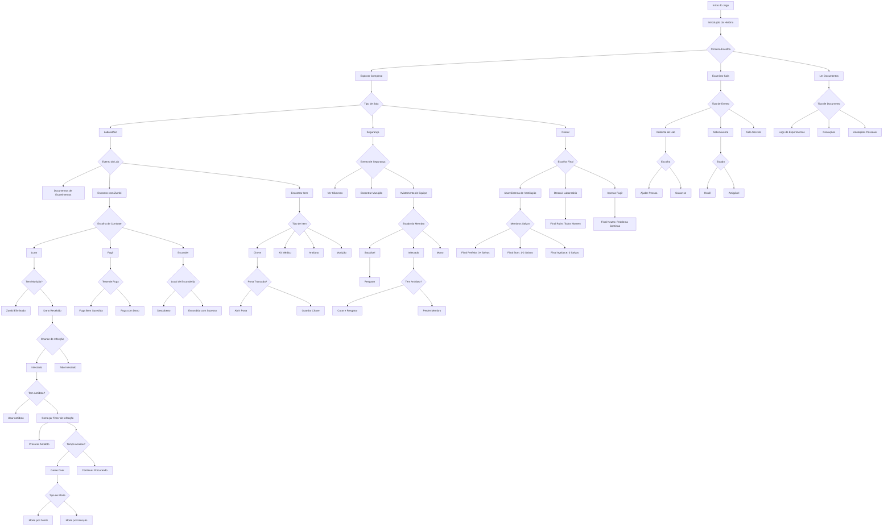
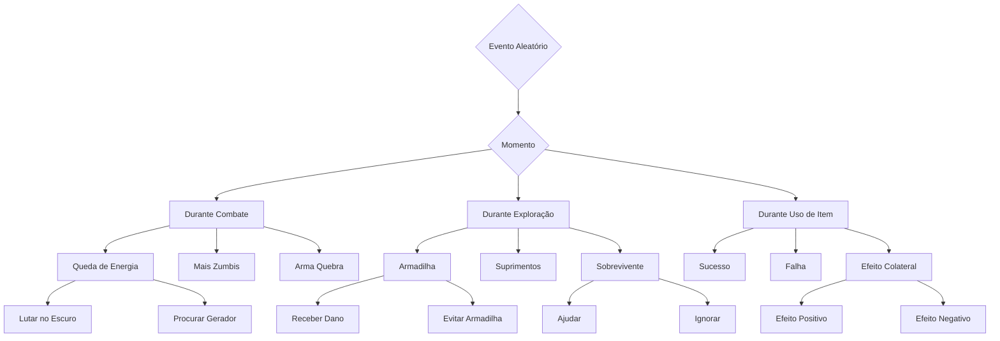
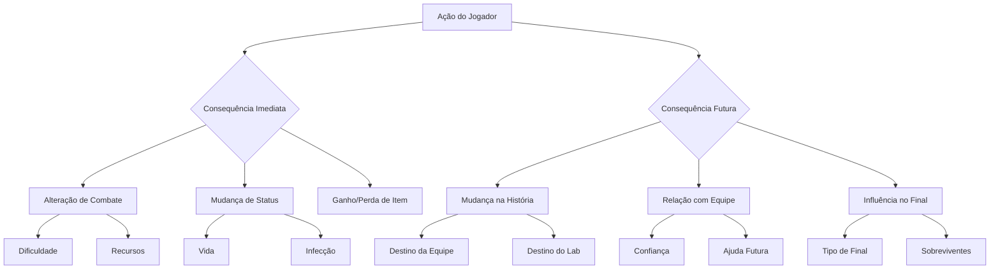

# 🧟 Uma Cura Desastrosa 🧪

```
██╗   ██╗███╗   ███╗ █████╗      ██████╗██╗   ██╗██████╗  █████╗ 
██║   ██║████╗ ████║██╔══██╗    ██╔════╝██║   ██║██╔══██╗██╔══██╗
██║   ██║██╔████╔██║███████║    ██║     ██║   ██║██████╔╝███████║
██║   ██║██║╚██╔╝██║██╔══██║    ██║     ██║   ██║██╔══██╗██╔══██║
╚██████╔╝██║ ╚═╝ ██║██║  ██║    ╚██████╗╚██████╔╝██║  ██║██║  ██║
 ╚═════╝ ╚═╝     ╚═╝╚═╝  ╚═╝     ╚═════╝ ╚═════╝ ╚═╝  ╚═╝╚═╝  ╚═╝
```

> Um jogo de aventura em texto onde você é um soldado das forças especiais em uma missão para investigar experimentos ilegais em uma empresa secreta. Sobreviva aos horrores, salve sua equipe e impeça que a infecção se espalhe!

## 📋 Índice
- [Instalação](#-instalação)
- [Como Jogar](#-como-jogar)
- [História](#-história)
- [Mecânicas](#-mecânicas)
- [Itens](#-itens)
- [Mapa](#-mapa)
- [Finais](#-finais)
- [Fluxograma](#-fluxograma)

## 💻 Instalação

1. Certifique-se de ter Python 3.6+ instalado
2. Clone este repositório:
   ```bash
   git clone https://github.com/seu-usuario/uma-cura-desastrosa.git
   ```
3. Execute o jogo:
   ```bash
   python game.py
   ```

## 🎮 Como Jogar

Use os comandos numerados para realizar ações:
```
1️⃣ Mover        - Explore o complexo
2️⃣ Examinar     - Investigue a sala atual
3️⃣ Pegar itens  - Colete recursos úteis
4️⃣ Usar itens   - Use itens do inventário
5️⃣ Inventário   - Veja seus itens
6️⃣ Documentos   - Leia documentos encontrados
7️⃣ Sair        - Encerra o jogo
```

## 📖 História

O ano é 2024. A Empresa X estava próxima de desenvolver a cura para o câncer, mas seus experimentos deram terrivelmente errado. Os pacientes se transformaram em criaturas violentas, e a infecção começou a se espalhar.

Você é parte de uma equipe de forças especiais enviada para investigar, mas se separa do grupo. Agora deve:
- 🔍 Investigar o que aconteceu
- 💉 Encontrar a cura
- 👥 Resgatar sua equipe
- 🧟 Sobreviver aos infectados

## ⚙️ Mecânicas

### Sistema de Vida
```
♥♥♥♥♥♥♥♥♥♥ 100% - Saudável
♥♥♥♥♥♥♥    70% - Ferido
♥♥♥        30% - Crítico
```

### Sistema de Infecção
- Se infectado, você tem 10 turnos para encontrar o antídoto
- A cada turno, perde vida gradualmente
- Chance de infecção ao ser atacado por zumbis

### Inventário
- Máximo de 5 itens
- Gerenciamento estratégico de recursos
- Itens podem ser encontrados ou ganhos em eventos

## 🎒 Itens

| Item | Descrição | Uso |
|------|-----------|-----|
| 🔑 Chave | Abre portas específicas | Único |
| 💉 Antídoto | Cura a infecção | Único |
| 🔫 Munição | Elimina zumbis | Múltiplo |
| 🏥 Kit Médico | Recupera 50 de vida | Único |

## 🗺️ Mapa

```
[Entrada] → [Recepção] → [Corredor Principal] → [Lab A]
    ↓           ↓              ↓                  ↓
[Segurança] → [Refeitório] → [Lab B] → [Sala de Testes]
    ↓           ↓              ↓                  ↓
[Depósito] → [Centro de Pesquisa] → [Lab Secreto] → [Reator]
```

## 🎯 Finais

### Finais Ruins 💀
- Morte por dano
- Morte por infecção
- Falha em salvar a equipe

### Finais Bons ⭐
- **Final Perfeito**: Salve 3+ membros e libere o antídoto
- **Final Bom**: Salve 1-2 membros e libere o antídoto
- **Final Agridoce**: Libere o antídoto sem salvar a equipe

## 📊 Fluxograma do Jogo

### Fluxo Principal


### Eventos Aleatórios


### Sistema de Consequências


Este fluxograma expandido mostra:

1. **Sistemas Principais**:
   - Exploração
   - Combate
   - Infecção
   - Gerenciamento de Itens
   - Resgate de Equipe

2. **Eventos Especiais**:
   - Encontros com Sobreviventes
   - Acidentes de Laboratório
   - Descobertas de Salas Secretas

3. **Sistemas de Consequências**:
   - Efeitos Imediatos
   - Consequências de Longo Prazo
   - Impacto nas Relações

4. **Eventos Aleatórios**:
   - Durante Combate
   - Durante Exploração
   - Durante Uso de Itens

5. **Múltiplos Finais**:
   - Baseados em Escolhas
   - Baseados em Sobreviventes
   - Baseados em Método de Resolução

6. **Tipos de Morte**:
   - Por Zumbis
   - Por Infecção
   - Por Acidentes

Cada decisão pode levar a diferentes caminhos e consequências, criando uma experiência única a cada jogada.

## 🎨 Cores do Terminal

O jogo usa cores ANSI para melhor visualização:
- 🔴 Vermelho: Perigo, dano
- 🟢 Verde: Sucesso, cura
- 🟡 Amarelo: Avisos
- 🔵 Azul: Informações
- 🟣 Roxo: Eventos especiais

## ⚠️ Dicas

- 💊 Mantenha sua vida alta usando kits médicos
- 📦 Gerencie bem seu inventário limitado
- 🔑 Procure chaves para acessar áreas bloqueadas
- 💉 Use o antídoto sabiamente
- 🏃 Evite zumbis quando possível
- 📝 Leia todos os documentos para entender a história
- 🤝 Priorize salvar membros da equipe

## 🎵 Efeitos Sonoros

O jogo inclui efeitos visuais para:
- 💥 Combate
- 🚪 Portas abrindo
- 💊 Uso de itens
- 🧟 Encontros com zumbis
- 📜 Descoberta de documentos
- 🏆 Finais especiais

## 🎮 Controles Alternativos

Além dos números, você pode usar:
- `w/a/s/d` para movimento
- `e` para examinar
- `i` para inventário
- `space` para ação
- `esc` para sair 